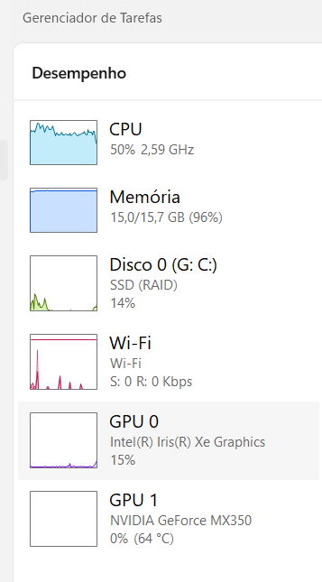
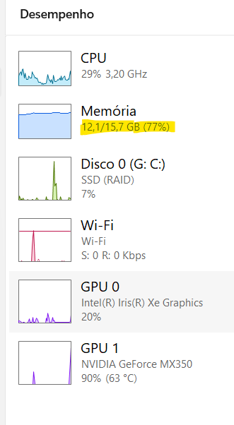
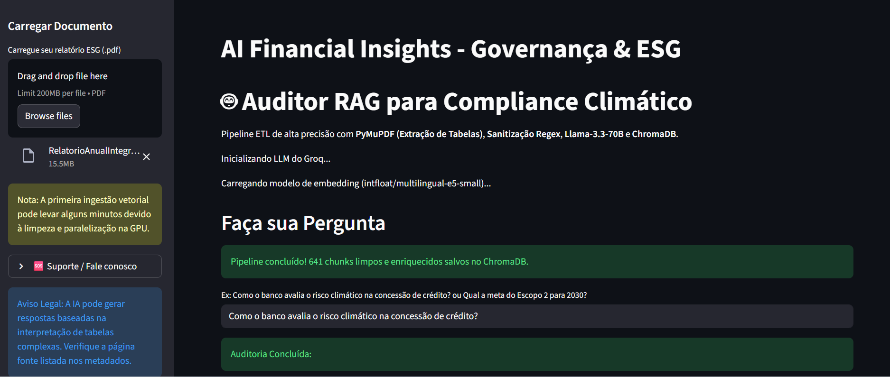
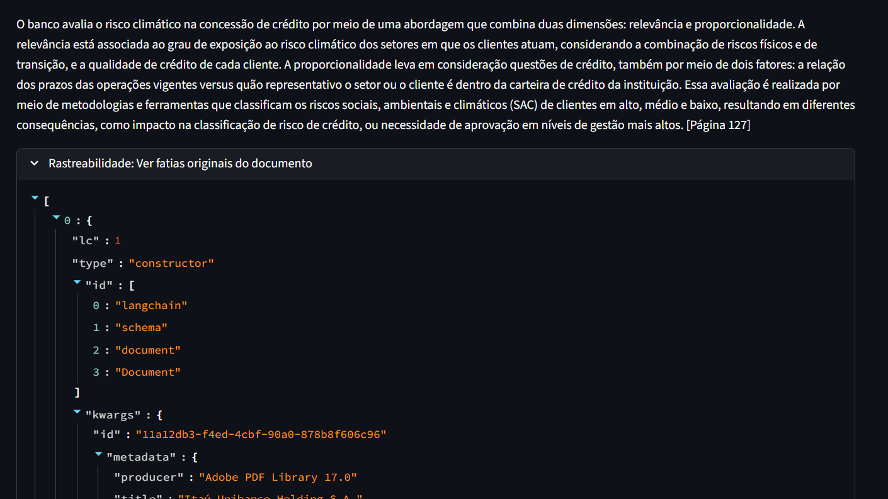
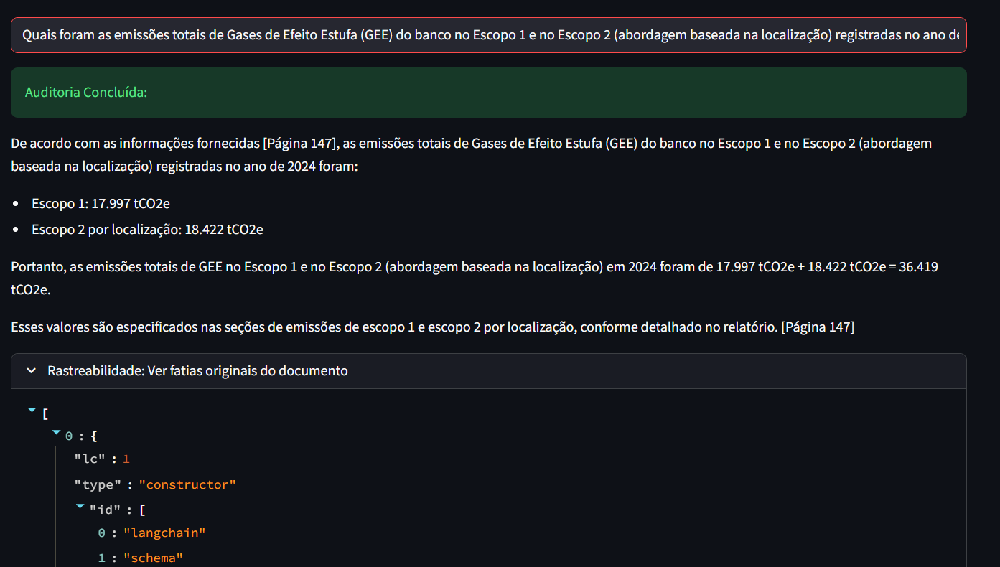
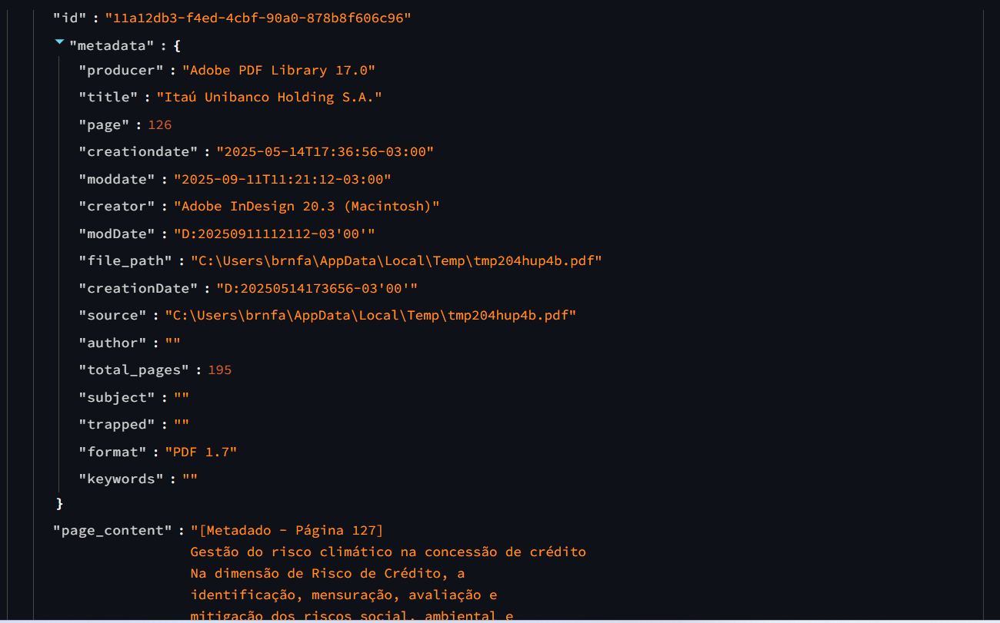

# Fase 1: Motor RAG Local para Auditoria ESG e Risco Climático 🌍🏦

## 📝 Descrição do Módulo
Foco na construção de uma arquitetura de *Retrieval-Augmented Generation* (RAG) para extração de dados densos em relatórios regulatórios de sustentabilidade. O projeto substitui buscas simples por palavras-chave por uma compreensão semântica profunda, permitindo cruzar métricas financeiras (ex: Preço Interno de Carbono) com metas climáticas (Escopos 1, 2 e 3).

## 🛠️ Stack Tecnológica (V2)
* **LLM (Motor Cognitivo):** `llama-3.3-70b-versatile` (via Groq API para inferência em milissegundos).
* **Embeddings (Vetorização local):** `intfloat/multilingual-e5-small` (HuggingFace).
* **Extração Estrutural (ETL):** `PyMuPDF` (Fitz) e Expressões Regulares (`Regex`).
* **Banco de Dados Vetorial:** ChromaDB.
* **Aceleração de Hardware:** CUDA (NVIDIA GPU) para processamento paralelo de tensores.
* **Interface (Front-end):** Streamlit com renderização de metadados em JSON.

---

## ⚙️ Engenharia de Dados: A Evolução para a V2.0

Relatórios ESG do setor financeiro são "pesadelos estruturais" para IAs: possuem layouts em múltiplas colunas, tabelas quebradas entre páginas e uma infinidade de notas de rodapé. A V2 desta arquitetura resolveu esses gargalos reescrevendo o pipeline de ingestão:

1. **Extração Estrutural de Tabelas (PyMuPDF):** Substituição de leitores de PDF ingênuos por um extrator que respeita o fluxo de leitura humano. Isso impediu que a IA misturasse os números do Escopo 1 com o Escopo 2 em tabelas complexas.
2. **Sanitização de Dados (Noise Cleaning):** Implementação de uma camada de limpeza via *Regex* antes da vetorização. Remoção de quebras de linha invisíveis e caracteres nulos, o que reduziu o lote original de 1024 para apenas **641 chunks semânticos** altamente qualificados.
3. **Data Enrichment (Injeção de Metadados):** O motor agora "carimba" a origem e o número exato da página fisicamente no início de cada bloco de texto. Isso obriga o LLM a fundamentar sua resposta apontando de onde tirou o dado.
4. **Otimização Extrema de Hardware (2GB VRAM):** Para viabilizar a vetorização massiva em hardware local restrito, a carga foi transferida da CPU para a GPU (`device: cuda`), operando com lotes reduzidos (`batch_size: 8`) e janela de contexto ampliada (`k=15`) para não perder o raciocínio macro.
5. **Zero-Shot Constraints (Anti-Alucinação):** Prompt de engenharia estrito configurado para a persona de Auditor de Compliance. Se a informação (ex: resultado de 2024 vs meta de 2025) não está clara no chunk, a IA trava e emite o alerta de segurança: *"A informação não consta nos documentos analisados"*.

---

## 📸 Fluxo de Uso e Evidências Visuais

Abaixo, as evidências de performance e a rastreabilidade do produto em ação.

### 1. Aceleração de Infraestrutura (Gargalo de Latência)
A ingestão de dados não estruturados massivos (276 páginas) exigiu a migração do processamento matemático da CPU para o paralelismo da GPU.

* **Antes (Gargalo em CPU):** Alta carga no processador principal e latência extrema na criação dos vetores.
  

* **Depois (Aceleração em GPU):** Placa de vídeo assumindo a carga, processando o documento em segundos.
  

### 2. O Pipeline RAG V2 em Ação

* **Ingestão Inteligente:** A prova da eficácia do *Noise Cleaning*. O sistema processou centenas de páginas e gerou 641 blocos limpos, sem estourar a memória.
  

* **Precisão e Citação de Fontes:** A IA cruza a política de crédito com o risco climático e entrega a resposta citando rigorosamente a `[Página 127]` do documento original.
  

* **Resolução de Consultas Complexas (Tabelas e Cálculos):** A prova de fogo da V2. O LLM extrai as métricas de Escopo 1 e Escopo 2 de colunas distintas da tabela, realiza a soma matemática exata em toneladas de CO2 equivalente (tCO2e) e fornece a rastreabilidade. Zero alucinação em jargões financeiros densos.
  

* **Rastreabilidade (Compliance):** Abertura do JSON nativo do banco vetorial na interface, comprovando aos auditores humanos o chunk exato que a IA consumiu para gerar o *insight*.
  

---

## 🚀 Roadmap (Próximos Passos)

* **Validação Temporal (2024 vs 2025):** Cruzamento e injeção do Relatório ESG 2025 (assim que divulgado) no motor vetorial para auditar automaticamente o cumprimento das metas assumidas no ano anterior.
* **Busca Híbrida (BM25 + Dense Vectors):** Combinação da busca semântica atual com motores de palavras-chave para garantir que siglas regulatórias específicas nunca sejam ignoradas.