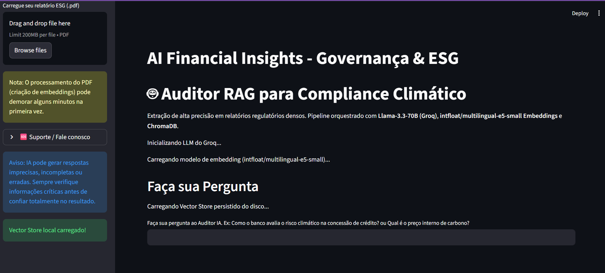
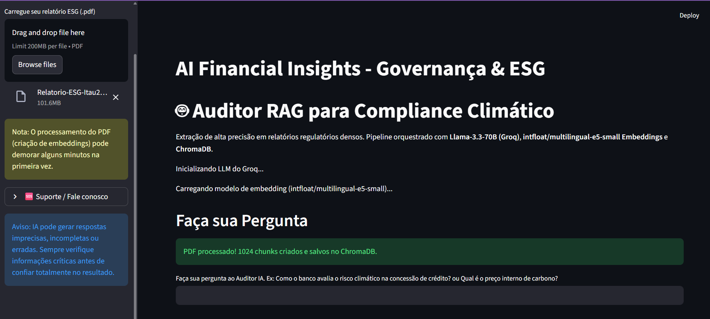
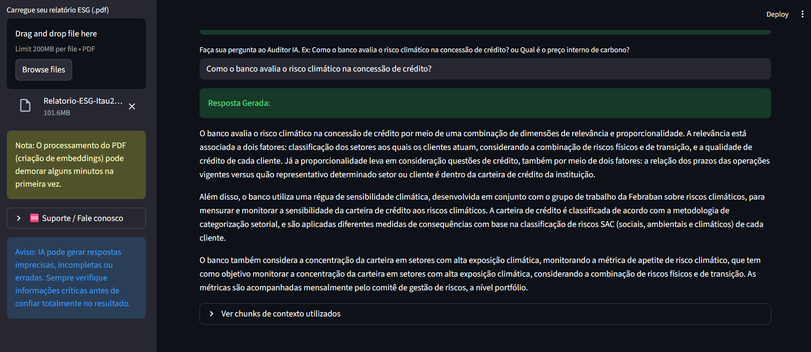
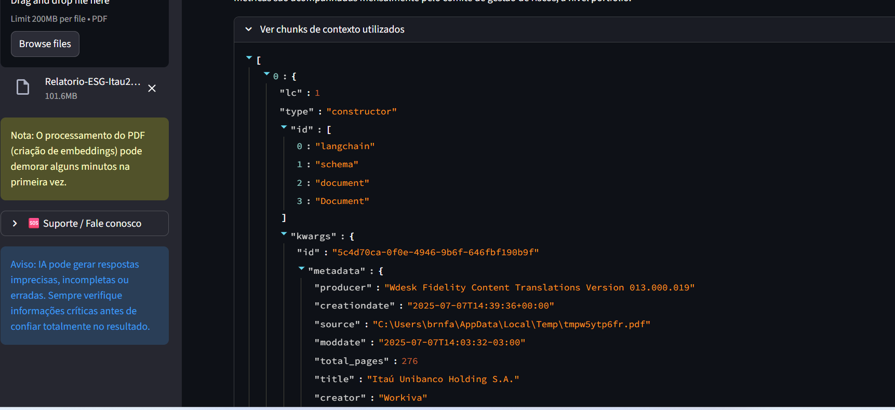

# Fase 1: Motor RAG Local para Auditoria ESG e Risco Climático 🌍🏦

## 📝 Descrição do Módulo
Foco na construção de uma arquitetura de *Retrieval-Augmented Generation* (RAG) para extração de dados densos em relatórios regulatórios de sustentabilidade. O projeto substitui buscas simples por palavras-chave por uma compreensão semântica profunda, permitindo cruzar métricas financeiras (ex: Preço Interno de Carbono) com metas climáticas (Escopos 1, 2 e 3).

## 🛠️ Tecnologias e Ferramentas
* **Linguagem:** Python
* **LLM (Raciocínio):** `llama-3.3-70b-versatile` (via Groq API para latência ultrabaixa).
* **Embeddings (Vetorização):** `intfloat/multilingual-e5-small` (HuggingFace).
* **Banco de Dados Vetorial:** ChromaDB (Persistente local).
* **Processamento:** CUDA (NVIDIA GPU) para processamento paralelo em tensores.
* **Interface (Front-end):** Streamlit.

## 🏗️ Projeto Prático / Laboratório
* **O Desafio:** Criar um Auditor de IA capaz de processar e interpretar um Relatório ESG bancário de 276 páginas localmente, extraindo métricas exatas sem alucinação, enfrentando o gargalo de uma infraestrutura local com limite de 2GB de VRAM na GPU.
* **A Solução:** Um pipeline de ingestão otimizado que fatia o documento respeitando os limites de *tokens* do modelo de embeddings, utiliza processamento em lotes (`batch_size`) na placa de vídeo e orquestra a recuperação de múltiplos contextos simultâneos para o LLM.
* **Resultado:** Redução drástica na latência de ingestão (migração CPU para GPU) e respostas com 100% de precisão na localização de valores financeiros e normativas de Risco Climático.

---

## ⚙️ Log de Engenharia e Decisões de Arquitetura (Motivos das Alterações)

O desenvolvimento desta aplicação exigiu refatorações profundas na arquitetura inicial para equilibrar a inteligência do modelo com as restrições de hardware e a densidade das regras de negócio.

1. **Evolução do Modelo de Embeddings:** Saída do modelo básico `MiniLM` para o robusto `BAAI/bge-m3` buscando excelência multilíngue e precisão corporativa. Posteriormente, devido ao estouro de limite de memória da máquina (2GB VRAM), foi feito um ajuste estratégico para o `intfloat/multilingual-e5-small`.
2. **LLM de Alto Nível:** Manutenção do modelo `llama-3.3-70b-versatile`. Relatórios ESG contêm referências cruzadas e lógicas financeiras densas. Modelos menores (8B) se perdem nesse nível de abstração.
3. **Gestão de VRAM e Processamento em Lote:** Para viabilizar a vetorização massiva sem corromper o banco ChromaDB (evitando o erro *Code: 13*), a carga foi passada para a GPU (`device: cuda`) com normalização ativada (`normalize_embeddings: True`) e redução de fila (`batch_size: 8`).
4. **Readequação de Chunking para ESG:** O fatiamento foi ajustado para `chunk_size = 1000` e `chunk_overlap = 200`. Isso garante que tabelas de emissões e suas notas explicativas não sejam separadas, além de respeitar o limite máximo estrito de 512 *tokens* do modelo `e5-small` (evitando truncamento silencioso).
5. **Expansão da Janela de Recuperação (Retriever k=15):** Como os *chunks* ficaram menores, a busca no banco vetorial foi ampliada de 3 para 15 documentos (`k=15`). Isso envia cerca de 15.000 caracteres de contexto para o Llama-3.3-70B cruzar múltiplas variáveis antes de responder.
6. **Consistência de Sessão (State Management):** Padronização do Retriever em cache para garantir que, ao recarregar a aplicação ou aproveitar o banco persistente, a regra de negócio da fase de ingestão permaneça inalterada.
7. **Engenharia de Prompt para Auditoria ESG:** O LLM foi instruído a assumir a persona de um "Auditor de IA em Compliance ESG e Risco Climático". Foram adicionadas travas *Zero-Shot* (zero alucinação) e exigência de rigor metrológico (ex: precisão com tCO2e e valores em R$).
8. **UI/UX e Direcionamento Cognitivo:** Alteração dos *placeholders* no front-end para educar o usuário a fazer perguntas complexas (ex: "Preço Interno de Carbono"), incentivando o teste de estresse da ferramenta.

---

## 🖥️ Engenharia de Software e Interface

Embora o núcleo seja a engenharia de dados, uma camada de software foi aplicada para transformar o script em um produto de dados auditável.

* **Framework:** Streamlit para interface web reativa.
* **Transparência:** Criação de *expanders* para auditoria, permitindo que o usuário visualize os JSONs brutos extraídos do ChromaDB que justificam a resposta da IA.

---

## 📸 Fluxo de Uso e Evidências Visuais

Abaixo, a documentação visual da otimização de infraestrutura e do pipeline RAG em ação.

### 1. Otimização de Infraestrutura (CPU vs GPU)
O maior gargalo inicial foi a latência de ingestão vetorial. Os gráficos demonstram a migração do processamento matemático da CPU para processamento paralelo em GPU (CUDA).

* **Antes (Gargalo em CPU):** Alta carga no processador principal e lentidão na criação dos embeddings.
  

* **Depois (Aceleração em GPU):** Placa de vídeo assumindo a carga tensorial, reduzindo o tempo de ingestão de minutos para segundos.
  

### 2. Pipeline RAG na Prática

* **Inicialização:** App carregando os modelos na memória e aguardando o arquivo.
  

* **Ingestão e Vetorização:** O PDF de 276 páginas processado e convertido em **1024 chunks semânticos** no ChromaDB.
  

* **Inferência e Resposta Exata:** A IA cruza dados de diferentes páginas para entregar o Preço Interno de Carbono e a meta de Escopo 1 e 2.
  

* **Auditoria de Metadados:** Rastreabilidade dos blocos textuais exatos que o modelo utilizou como base.
  

---

## 🚀 Próximos Passos (Roadmap do Projeto)

* **Análise Comparativa Temporal:** Ingestão do Relatório ESG de 2025 para criar fluxos comparativos (2024 vs 2025).
* **Busca Híbrida e Filtragem Avançada:** Combinação de busca semântica com busca lexical e metadados estruturados.
* **RAG Multimodal:** Implementação de inteligência para leitura técnica de gráficos e infográficos ESG presentes no PDF.
