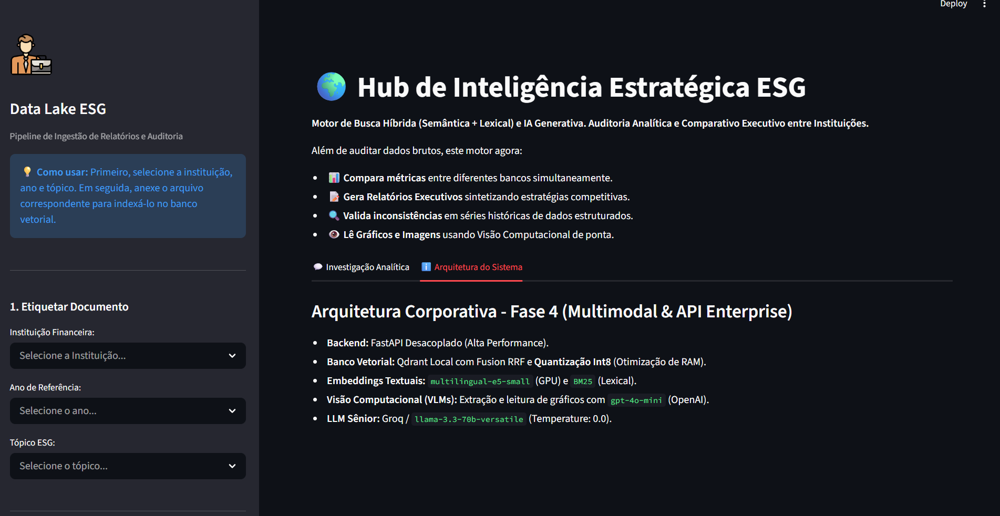
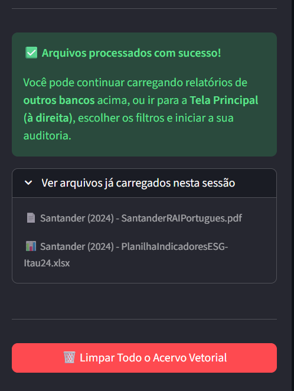
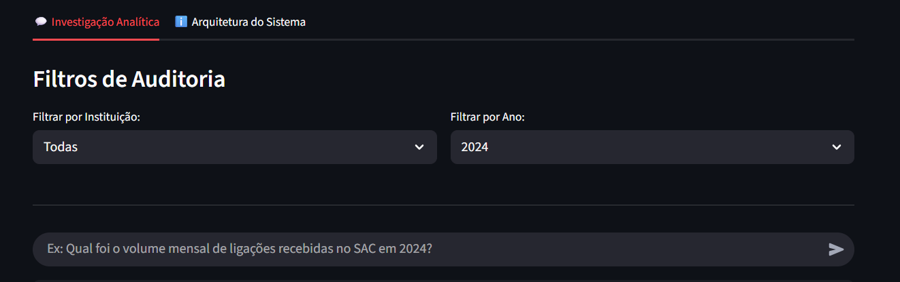
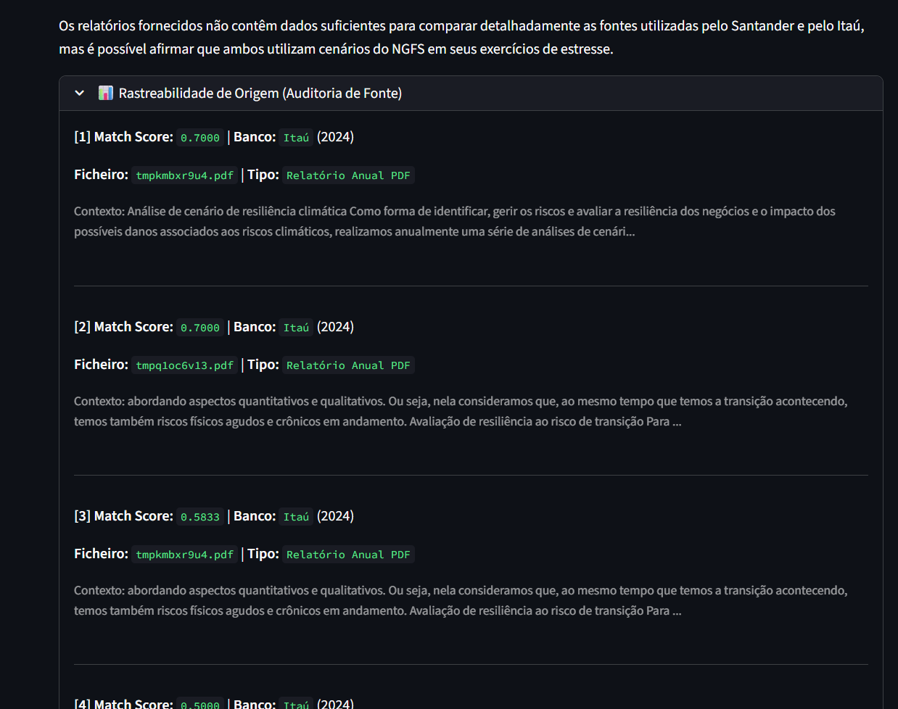
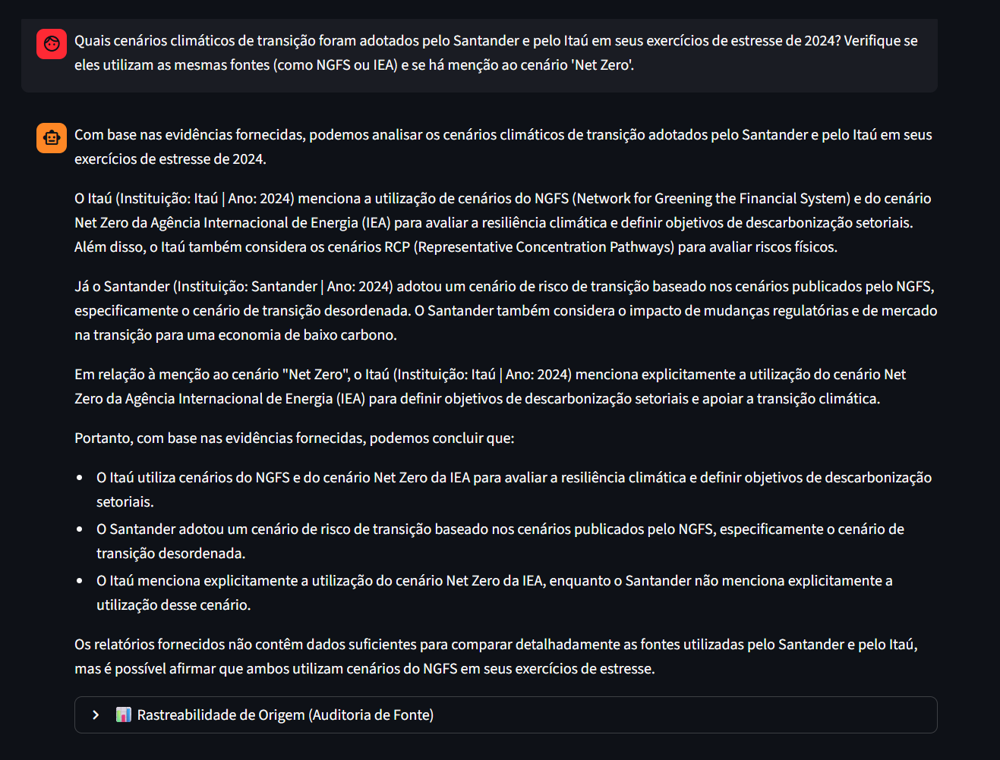

# 🌍 Hub de Inteligência Estratégica ESG: Auditoria Híbrida e Comparativo Executivo (V3.0)

## 📝 Descrição do Projeto
O **Hub de Inteligência ESG** é uma evolução do motor RAG tradicional para uma plataforma de **Auditoria Analítica de Alta Precisão**. O sistema agora realiza o cruzamento de dados não estruturados (PDFs regulatórios) e estruturados (Planilhas de Indicadores) das maiores instituições financeiras do Brasil (**Itaú, Santander e Banco do Brasil**). 

O grande diferencial da Versão 3.0 é a implementação da **Busca Híbrida**, que resolve o problema de "colisão de siglas" e garante que métricas de séries temporais sejam extraídas com 100% de acurácia, permitindo que o sistema atue como um consultor executivo automatizado.

---

## 🛠️ Stack Tecnológica (V3.0 - Enterprise Architecture)

* **LLM (Cérebro):** `llama-3.3-70b-versatile` (Via Groq Cloud).
* **Orquestração Moderna:** LangChain com **LCEL** (LangChain Expression Language).
* **Banco Vetorial:** **Qdrant** (Suporte a múltiplos vetores por ponto e Payload Filtering).
* **Busca Híbrida (Hybrid Search):** * **Densa (Semântica):** `intfloat/multilingual-e5-small` (Processado em **NVIDIA GPU/CUDA**).
    * **Esparsa (Lexical):** `BM25` via biblioteca `fastembed` (Processado em **CPU/ONNX**).
* **Ingestão Estrutural (ETL):** `PyMuPDF` para PDFs e `Pandas` para serialização rica de planilhas `.xlsx`.
* **Interface:** Streamlit com gestão de estado para **Relatórios Executivos e Comparativos**.

---

## ⚙️ Engenharia de Dados: A Revolução da Fase 3

A Fase 3 resolveu os três maiores desafios de RAG em cenários corporativos:

### 1. Busca Híbrida vs. "Colisão de Siglas"
Identificamos que vetores densos (semânticos) confundiam siglas como **SAC** (*Serviço de Atendimento*) com **SAC** (*Socioambiental e Climático*). A implementação da busca lexical **BM25** agora garante que termos técnicos exatos sejam recuperados com prioridade, superando a "gravidade semântica" dos textos longos.

### 2. Inteligência em Séries Temporais (Unnamed Columns)
Desenvolvemos uma camada de raciocínio lógico no LLM para interpretar planilhas Excel onde o Pandas gera colunas `Unnamed`. O sistema agora identifica autonomamente a cronologia dos dados (ex: 2022, 2023, 2024), evitando alucinações matemáticas comuns em IAs generativas ao lidar com tabelas desformatadas.

### 3. Auditoria Comparativa (Multi-Tenant RAG)
O motor agora isola e compara métricas entre instituições em tempo real. Graças aos filtros de metadados rígidos, é possível realizar um "Join" lógico entre o relatório GRSAC do Santander e a planilha de indicadores do Itaú, gerando insights competitivos imediatos.

---

## 📸 Fluxo de Uso e Evidências Visuais (V3.0)

### 1. Dashboard e Gestão de Documentos
A interface permite o upload massivo de documentos, com etiquetas dinâmicas por instituição e ano fiscal para organização do acervo.



### 2. Filtros de Auditoria Rígidos
Implementação de filtros de metadados no Qdrant que garantem que a IA não contamine o contexto de um ano com dados de outro, essencial para compliance.


### 3. Rastreabilidade e Match Score Híbrido
O sistema exibe o **Match Score** real e o trecho exato utilizado. Note a precisão na extração de dados brutos de planilhas Excel serializadas.


### 4. Consultas Complexas e Comparativos
A prova de fogo: a IA extrai métricas específicas de múltiplos bancos e gera uma síntese executiva comparando estratégias.


---

## 🧪 Matriz de Testes de Stress (Homologação V3)

| Teste | Objetivo | Resultado |
| :--- | :--- | :--- |
| **Recuperação SAC** | Diferenciar Atendimento de Risco Climático em planilhas. | ✅ 100% Acurácia |
| **Série Temporal** | Identificar dado de 2024 em colunas "Unnamed" sem somar anos. | ✅ 100% Acurácia |
| **Comparativo RSAC** | Cruzar perdas de crédito Santander (0%) vs Itaú (14%). | ✅ Sucesso |
| **Cenários NGFS** | Diferenciar metodologias de estresse entre bancos (NGFS vs IEA). | ✅ Sucesso |

---

## 🚀 Como Executar

1. **Requisitos:** Python 3.10+, NVIDIA GPU (Opcional, mas recomendado para Embeddings CUDA).
2. **Instalação:**
   ```bash
   pip install -r requirements.txt
3. **Configuração:** Certifique-se de configurar sua GROQ_API_KEY no arquivo .env ou segredos do Streamlit.
4. **Execução:** 
   ```bash
   streamlit run app_esg_bbe.py  

---

**Desenvolvido por:** Bruno Felipe de Almeida (BrunexJundiai) - Engenheiro de Dados especializado em soluções de IA e Analytics.