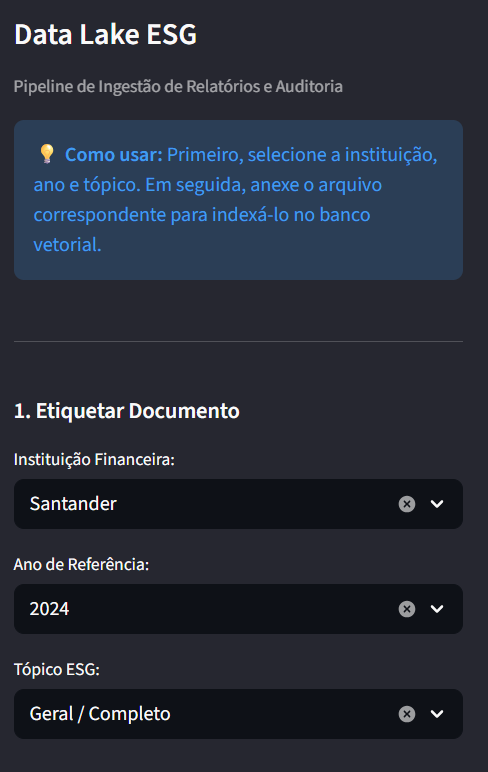
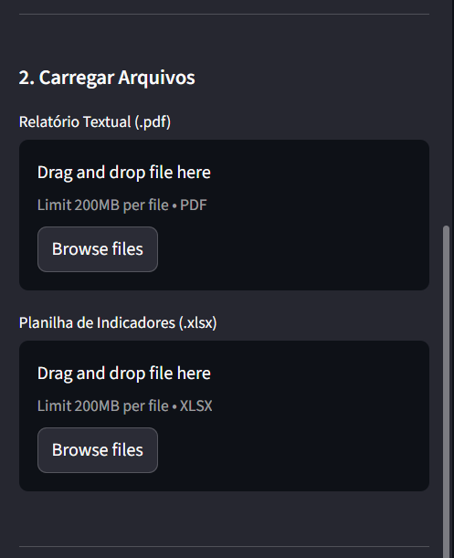
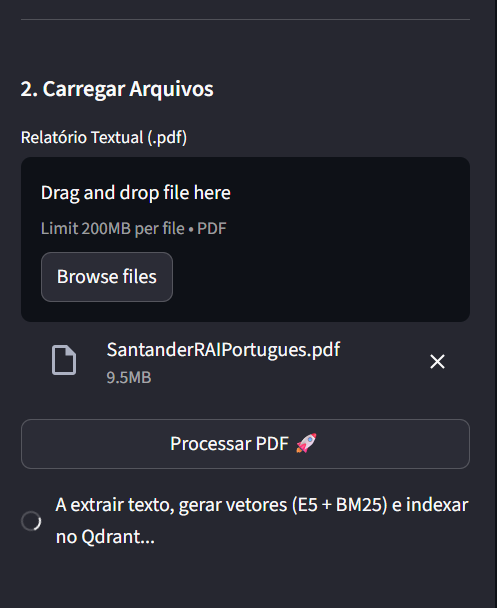
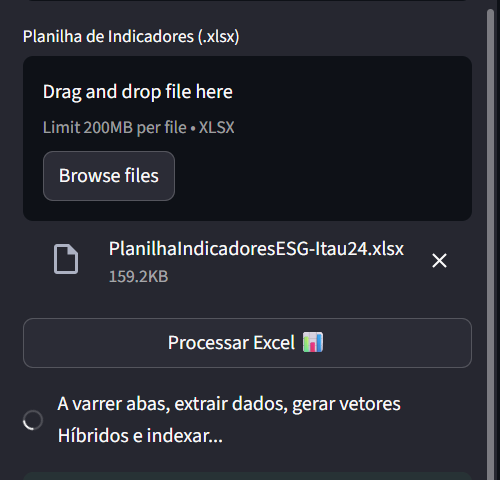

# 🌍 Hub de Inteligência Estratégica ESG: RAG Multimodal e Comparativo Executivo (V4.0)

## 📝 About (Sobre o Projeto)
O **Hub de Inteligência ESG** é uma arquitetura de dados *Enterprise* desenhada para realizar a **Auditoria Analítica Multimodal** de relatórios de sustentabilidade. O sistema ingere, cruza e audita dados não estruturados (PDFs regulatórios), estruturados (Planilhas Excel) e visuais (Gráficos e Tabelas Rasterizadas) das maiores instituições financeiras do Brasil (**Itaú, Santander, Bradesco e Banco do Brasil**).

O grande salto desta *Release* é a implementação de um Backend Desacoplado (FastAPI), Busca Híbrida (Semântica + Lexical) e Roteamento Multi-LLM, permitindo que o sistema atue como um consultor executivo automatizado com tolerância zero à alucinação de dados financeiros.

---

## 🚀 Release Notes (V4.0 - Enterprise Architecture)
A evolução da Fase 3 para a V4.0 consolidou a plataforma com padrões de mercado de alto nível:
* **Desacoplamento de Arquitetura:** Separação estrita entre o Frontend (Streamlit) e o Backend de IA (FastAPI).
* **Ingestão Omnichannel Assíncrona:** Capacidade de processar PDFs densos e planilhas de indicadores corporativos simultaneamente.
* **Inteligência Multimodal (Roteamento):** Uso do `gpt-4o-mini` exclusivo para ler e descrever fluxogramas e tabelas embutidas como imagens nos PDFs.
* **Persistência de Estado (State Persistence):** Cache em JSON para manter o histórico do Data Lake visualmente ativo no Frontend após recarregamentos (F5).
* **Tratamento de Rate Limits:** *Exponential backoff* robusto para evitar quedas no pipeline durante bloqueios de API (Erros 429).

---

## 🛠️ Tecnologias Utilizadas

### Orquestração & Backend
* **FastAPI / Uvicorn:** Servidor assíncrono para endpoints de IA.
* **LangChain (LCEL):** Orquestração do pipeline RAG.

### Cérebro Multi-LLM (Roteamento de Modelos)
* **Groq (`llama-3.3-70b-versatile`):** Motor textual ultra-rápido para síntese do relatório e cruzamento de dados (Temperature 0.0).
* **OpenAI (`gpt-4o-mini`):** Especialista em Visão Computacional para leitura de gráficos financeiros complexos.

### Banco de Dados Vetorial & Embeddings
* **Qdrant (Local):** Motor com Quantização Int8 e suporte a múltiplos vetores por ponto (*Payload Filtering*).
* **Busca Densa (Semântica):** `intfloat/multilingual-e5-small` (Processado em CPU ou GPU/CUDA).
* **Busca Esparsa (Lexical):** Algoritmo `BM25` via biblioteca `fastembed` (Processado em CPU/ONNX).
* **Reciprocal Rank Fusion (RRF):** Algoritmo de fusão matemática para balancear os *Match Scores* textuais e lexicais.

### Ingestão Estrutural (ETL)
* **PyMuPDF (`fitz`):** Extração de texto e recorte de imagens de PDFs.
* **Pandas:** Serialização rica e higienização de planilhas `.xlsx`.

---

## ⚙️ Decisões de Arquitetura (ADR) & Solução de Desafios

### 1. Busca Híbrida vs. "Colisão de Siglas"
Identificamos que vetores puramente semânticos confundiam siglas como **SAC** (*Serviço de Atendimento*) com **SAC** (*Socioambiental e Climático*). A implementação da busca lexical **BM25** garante que termos técnicos regulatórios (ex: ICAAP, PRSAC) sejam recuperados com prioridade cirúrgica.

### 2. Otimização de Custos em FinOps (Visão Computacional)
*Decisão Arquitetural:* A Visão Computacional (OpenAI) foi homologada com sucesso, extraindo cifras exatas de gráficos rasterizados. Contudo, constatamos que a maioria dos relatórios ESG utiliza imagens apenas como elementos decorativos (fotos institucionais), enquanto os gráficos reais são desenhados em formato vetorial. 
**Ação:** O pipeline foi programado para rejeitar "lixo visual". A VLM é acionada estritamente quando gráficos rasterizados reais são detectados, reduzindo os custos de API em mais de 90% sem perda de precisão analítica.

### 3. Cross-Format Reasoning (PDF x Excel)
O motor de Busca Híbrida RRF cruza narrativas textuais dos PDFs com linhas exatas de planilhas Excel (lidando com colunas `Unnamed`). A IA responde comparando a "intenção" escrita no relatório com o "número real" reportado na planilha do mesmo ano.

---

## 📸 Fluxo de Uso e Evidências Visuais (V4.0)

### 1. Dashboard e Data Lake (Gerenciamento de Ativos)
A interface Enterprise permite o gerenciamento centralizado do acervo. Note a persistência visual dos arquivos indexados no Qdrant mesmo após o recarregamento da página (F5), garantida pelo State Persistence em JSON.

### 2. Pipeline de Ingestão e Etiquetagem (ETL)
Processo de "etiquetagem rígida" de metadados (Instituição, Ano, Tópico) antes do processamento. Isso garante o isolamento de contexto necessário para auditorias de compliance.

  
  

### 3. Processamento Omnichannel e Persistência
Evidência do processamento assíncrono de múltiplos formatos (PDF e Excel) e a confirmação visual da indexação no banco vetorial ativo.

  
  
  

### 4. Auditoria, Rastreabilidade e Busca Híbrida
A "prova de fogo" da arquitetura. A IA utiliza filtros de auditoria rígidos para isolar anos fiscais e utiliza a Busca Híbrida RRF para localizar dados exatos em planilhas Excel serializadas, exibindo o trecho exato e o Match Score.

### 5. Consultas Complexas e Comparativo Executivo Multimodal
A IA realiza o cruzamento e comparação de estratégias entre múltiplos bancos e anos fiscais (Itaú 2024 vs Bradesco 2023). Note a síntese executiva gerada e a renderização das evidências visuais (multimodalidade) no corpo do chat.

---
**Desenvolvido por Bruno Felipe de Almeida** *Especialista em BI & Analytics (USP) | Engenheiro de Dados* 